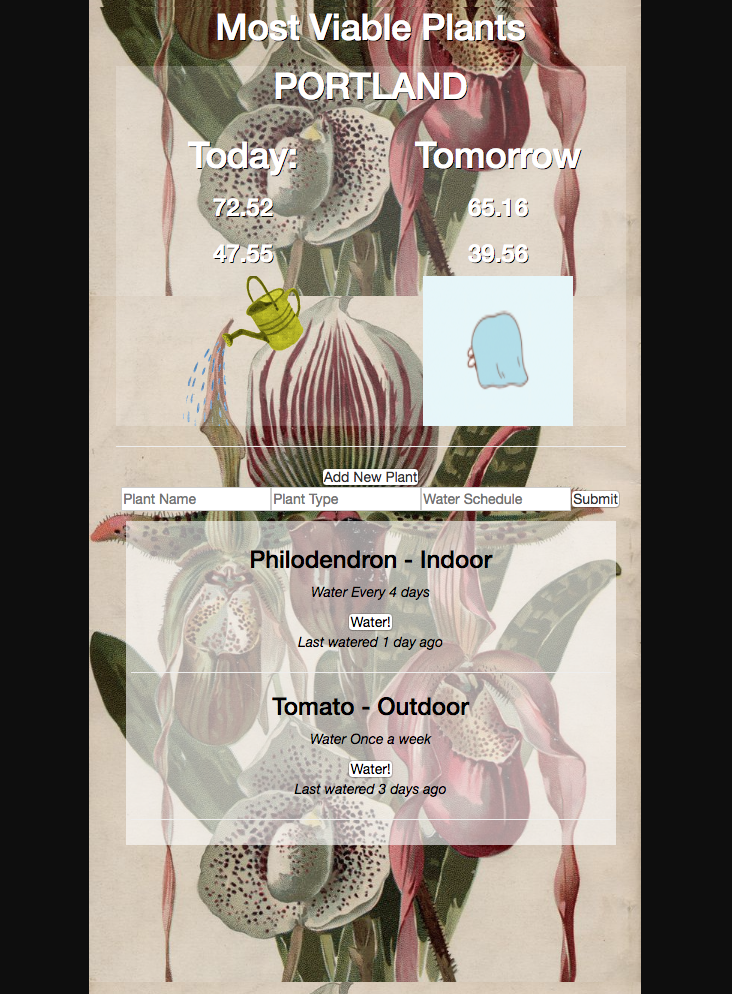

# Most Viable Plants
#### _Epicodus Capstone Project October 5th, 2017_
_**By Michelle Poterek**_

## Description
This is an application to make the gardening season seamless. This application will alert the user if the high is going to be above 90 so they can water the plants accordingly, or if the weather is going to be below 35 so they can cover them.

## Installation

OR:
In Terminal,
* `git clone https://github.com/PoterekM/most-viable-plants.git`
* `cd most-viable-plants`
* `npm install`
* `npm run start`
* In your browser,
  * Visit the app at http://localhost:8080.

## MVP User Story
* A user should be able to go to the website and see the high and low for today and tomorrow with symbols on page according to temperature.
* A user should be able to fill out a form as to what the plant name is, plant type, and how often it should be watered.

### Wishlist
* A user should be able to click a button to adjust the last time the plant has been watered.
* A user should be able to hit a button if it rains so all of the plants share a "last watered" date.
* Data is persistent in Firebase.
* A user can search through an API for best planting practice.
* A user can visually see their history of watering.
* A user can add more actions: planting, adding compost, harvesting.
* A user can get a calendar notification.

## To Do list
* Clean up response from API and remove decimal points from weather display.
* Wednesday have moment since watered working.
* Wednesday/Thursday design application.
* for scaleability it might be wise to make a for loop to display temperature info. It would be a bit verbose to have 3-10 day forecast and have to set the image parameter for each one.

## Development Planning
* Build application as presentational components initially.
* Display API information of high and low to the user.
* Add alert for if it should be watered or not.
* Build form for input.
* Adjust click functionality for moment since watered for component.

## Program Preview

## Technologies Used
* React
* Redux
* Babel
* Jest

## Support and contact details
Please feel free to contact me directly via e-mail at poterekm@gmail.com if you have any questions, comments, ideas, or feedback. Also, I invite you to feel empowered to make any changes to this repository by forking it and making changes accordingly.

## License Information
This web application is free to use under the MIT License &copy; Michelle Poterek
